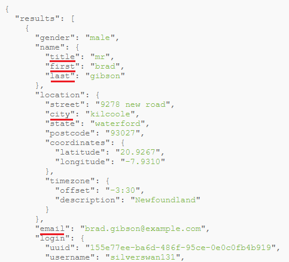

# [React Table 7 - Hooks based library](https://thewidlarzgroup.com/react-table-7/)

# Table of Contents
- [React Table 7 - Hooks based library](#react-table-7---hooks-based-library)
- [Table of Contents](#table-of-contents)
  - [Project Setup](#project-setup)
  - [Prepare Data](#prepare-data)
  - [Define Columns](#define-columns)
  - [Table Rendering - useTable hook](#table-rendering---usetable-hook)
  - [Add Bootstrap Table Style](#add-bootstrap-table-style)
  - [Custom Cell](#custom-cell)
  - [Sorting - useSortBy hook](#sorting---usesortby-hook)
  - [Filtering - useFilters hook](#filtering---usefilters-hook)
  - [Sub Components - useExpanded hook](#sub-components---useexpanded-hook)

## Project Setup

```console
npm i react-table
```

**[⬆ back to top](#table-of-contents)**

## Prepare Data

```javascript
// app.js
import React, { useEffect, useState } from "react"

const App = () => {
  const [data, setData] = useState([])
  useEffect(() => {
    const doFetch = async () => {
      const response = await fetch("https://randomuser.me/api/?results=100")
      const body = await response.json()
      const contacts = body.results
      console.log(contacts)
      setData(contacts)
    }
    doFetch()
  }, [])

  return <div>Hello</div>
}
```

**[⬆ back to top](#table-of-contents)**

## Define Columns



```javascript
const columns = useMemo(
  () => [
    {
      Header: "Title",
      accessor: "name.title",
    },
    {
      Header: "First Name",
      accessor: "name.first",
    },
    {
      Header: "Last Name",
      accessor: "name.last",
    },
    {
      Header: "Email",
      accessor: "email",
    },
    {
      Header: "City",
      accessor: "location.city",
    },
    {
      Header: 'Hemisphere',
      accessor: (values) => {
        const { latitude, longitude } = values.location.coordinates;
        const first = Number(latitude) > 0 ? 'N' : 'S';
        const second = Number(longitude) > 0 ? 'E' : 'W';
        return first + '/' + second;
      },
      // we can also write code below as a separate React Component
      Cell: ({ cell }) => {
        const { value } = cell;

        const pickEmoji = (value) => {
          let first = value[0]; // N or S
          let second = value[2]; // E or W
          const options = ['⇖', '⇗', '⇙', '⇘'];
          let num = first === 'N' ? 0 : 2;
          num = second === 'E' ? num + 1 : num;
          return options[num];
        };

        return (
          <div style={{ textAlign: 'center', fontSize: 18 }}>
            {pickEmoji(value)}
          </div>
        );
      }
    },
  ],
  []
)
```

**[⬆ back to top](#table-of-contents)**

## Table Rendering - useTable hook

```javascript
// TableContainer.js
import React from "react"
import { useTable } from "react-table"

const TableContainer = ({ columns, data }) => {
  const {
    getTableProps,
    getTableBodyProps,
    headerGroups,
    rows,
    prepareRow,
  } = useTable({
    columns,
    data,
  })

  return (
    // If you're curious what props we get as a result of calling our getter functions (getTableProps(), getRowProps())
    // Feel free to use console.log()  This will help you better understand how react table works under the hood.
    <table {...getTableProps()}>
      <thead>
        {headerGroups.map(headerGroup => (
          <tr {...headerGroup.getHeaderGroupProps()}>
            {headerGroup.headers.map(column => (
              <th {...column.getHeaderProps()}>{column.render("Header")}</th>
            ))}
          </tr>
        ))}
      </thead>

      <tbody {...getTableBodyProps()}>
        {rows.map(row => {
          prepareRow(row)
          return (
            <tr {...row.getRowProps()}>
              {row.cells.map(cell => {
                return <td {...cell.getCellProps()}>{cell.render("Cell")}</td>
              })}
            </tr>
          )
        })}
      </tbody>
    </table>
  )
}

export default TableContainer
```

**[⬆ back to top](#table-of-contents)**

## Add Bootstrap Table Style

```console
npm i bootstrap reactstrap
```

```javascript
// App.js
import { Container } from "reactstrap"
import "bootstrap/dist/css/bootstrap.min.css"

return (
  <Container style={{ marginTop: 100 }}>
    <TableContainer columns={columns} data={data} />
  </Container>
)
```

```javascript
// TableContainer.js
import { Table } from 'reactstrap';

<Table bordered hover {...getTableProps()}>
```

**[⬆ back to top](#table-of-contents)**

## Custom Cell

```javascript
{
  Header: 'Color',
  accessor: 'color'
    // Cell has access to row values. If you are curious what is inside cellProps, you can  console log it
  Cell: (cellProps) => {
    return <YourReactComponent {...cellProps}/>
  }
}
```

```javascript
{
  Header: 'Hemisphere',
  accessor: (values) => {
    const { latitude, longitude } = values.location.coordinates;
    const first = Number(latitude) > 0 ? 'N' : 'S';
    const second = Number(longitude) > 0 ? 'E' : 'W';
    return first + '/' + second;
  }
}
```

```javascript
{
  Header: 'Hemisphere',
  // In accessor, we will destructure values for latitude and longitude to determine which hemisphere the user is on.
  accessor: (values) => {
    const { latitude, longitude } = values.location.coordinates;
    const first = Number(latitude) > 0 ? 'N' : 'S';
    const second = Number(longitude) > 0 ? 'E' : 'W';
    return first + '/' + second;
  },
  // we can also write code below as a separate React Component
  Cell: ({ cell }) => {
    const { value } = cell;

    const pickEmoji = (value) => {
      let first = value[0]; // N or S
      let second = value[2]; // E or W
      const options = ['⇖', '⇗', '⇙', '⇘'];
      let num = first === 'N' ? 0 : 2;
      num = second === 'E' ? num + 1 : num;
      return options[num];
    };

    return (
      <div style={{ textAlign: 'center', fontSize: 18 }}>
        {pickEmoji(value)}
      </div>
    );
  }
}
```

**[⬆ back to top](#table-of-contents)**

## Sorting - useSortBy hook

```javascript
// TableContainer.js
import { useTable, useSortBy } from "react-table"

const {
  getTableProps,
  getTableBodyProps,
  headerGroups,
  rows,
  prepareRow,
} = useTable(
  {
    columns,
    data,
  },
  useSortBy
)

const generateSortingIndicator = column => {
  return column.isSorted ? (column.isSortedDesc ? " 🔽" : " 🔼") : ""
}

<th {...column.getHeaderProps(column.getSortByToggleProps())}>
  {column.render("Header")}
  {generateSortingIndicator(column)}
</th>
```

```javascript
// App.js
// disable sorting in a particular column
{
  Header: 'Title',
  accessor: 'name.title'
  disableSortBy: true
},
```

**[⬆ back to top](#table-of-contents)**

## Filtering - useFilters hook

```javascript
// filters.js
import React from "react"
import { Input, CustomInput } from "reactstrap"

export const Filter = ({ column }) => {
  return (
    <div style={{ marginTop: 5 }}>
      {column.canFilter && column.render("Filter")}
    </div>
  )
}

export const DefaultColumnFilter = ({
  column: {
    filterValue,
    setFilter,
    preFilteredRows: { length },
  },
}) => {
  return (
    <Input
      value={filterValue || ""}
      onChange={e => {
        setFilter(e.target.value || undefined)
      }}
      placeholder={`search (${length}) ...`}
    />
  )
}

export const SelectColumnFilter = ({
  column: { filterValue, setFilter, preFilteredRows, id },
}) => {
  const options = React.useMemo(() => {
    const options = new Set()
    preFilteredRows.forEach(row => {
      options.add(row.values[id])
    })
    return [...options.values()]
  }, [id, preFilteredRows])

  return (
    <CustomInput
      id="custom-select"
      type="select"
      value={filterValue}
      onChange={e => {
        setFilter(e.target.value || undefined)
      }}
    >
      <option value="">All</option>
      {options.map(option => (
        <option key={option} value={option}>
          {option}
        </option>
      ))}
    </CustomInput>
  )
}
```

```javascript
// TableContainer.js
import { useTable, useSortBy, useFilters } from "react-table"
import { Filter, DefaultColumnFilter } from './filters';

const {
  getTableProps,
  getTableBodyProps,
  headerGroups,
  rows,
  prepareRow,
} = useTable(
  {
    columns,
    data,
    defaultColumn: { Filter: DefaultColumnFilter }
  },
  useFilters,
  useSortBy
)

<th {...column.getHeaderProps()}>
  <div {...column.getSortByToggleProps()}>
    {column.render("Header")}
    {generateSortingIndicator(column)}
  </div>
  <Filter column={column} />
</th>
```

```javascript
// App.js
import { SelectColumnFilter } from './filters';

{
  Header: 'Title',
  accessor: 'name.title',
  Filter: SelectColumnFilter,
  filter: 'equals', // by default, filter: 'text', but in our case we don't want to filter options like text, we want to find exact match of selected option.
  disableFilters: true
}
```

**[⬆ back to top](#table-of-contents)**

## Sub Components - useExpanded hook

```javascript
import { useTable, useSortBy, useFilters, useExpanded } from 'react-table';

  const {
    getTableProps,
    getTableBodyProps,
    headerGroups,
    rows,
    prepareRow,
    visibleColumns,
  } = useTable(
    {
      columns,
      data,
      defaultColumn: { Filter: DefaultColumnFilter },
    },
    useFilters,
    useSortBy,
    useExpanded
  );

<Fragment key={row.getRowProps().key}>
  <tr>
    {row.cells.map(cell => {
      return <td {...cell.getCellProps()}>{cell.render("Cell")}</td>
    })}
  </tr>
  {row.isExpanded && (
    <tr>
      <td colSpan={visibleColumns.length}>{renderRowSubComponent(row)}</td>
    </tr>
  )}
</Fragment>
```

```javascript
// App.js
{
  Header: () => null,
  id: 'expander', // 'id' is required
  Cell: ({ row }) => (
    <span {...row.getToggleRowExpandedProps()}>
      {row.isExpanded ? '👇' : '👉'}
    </span>
  )
},

import {
  Container,
  Card,
  CardImg,
  CardText,
  CardBody,
  CardTitle,
} from "reactstrap"

const renderRowSubComponent = row => {
  const {
    name: { first, last },
    location: { city, street, postcode },
    picture,
    cell,
  } = row.original
  return (
    <Card style={{ width: "18rem", margin: "0 auto" }}>
      <CardImg top src={picture.large} alt="Card image cap" />
      <CardBody>
        <CardTitle>
          <strong>{`${first} ${last}`} </strong>
        </CardTitle>
        <CardText>
          <strong>Phone</strong>: {cell} <br />
          <strong>Address:</strong> {`${street.name} ${street.number} - ${postcode} - ${city}`}
        </CardText>
      </CardBody>
    </Card>
  )
}

<TableContainer
  columns={columns}
  data={data}
  renderRowSubComponent={renderRowSubComponent}
/>
```
**[⬆ back to top](#table-of-contents)**